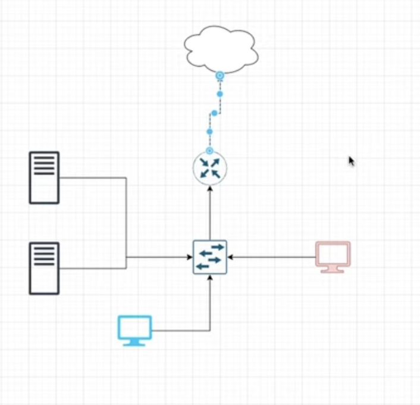
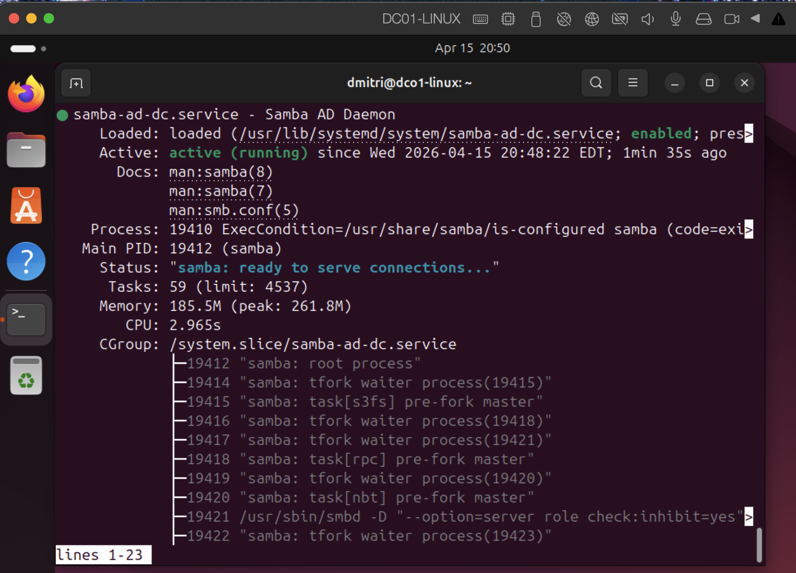
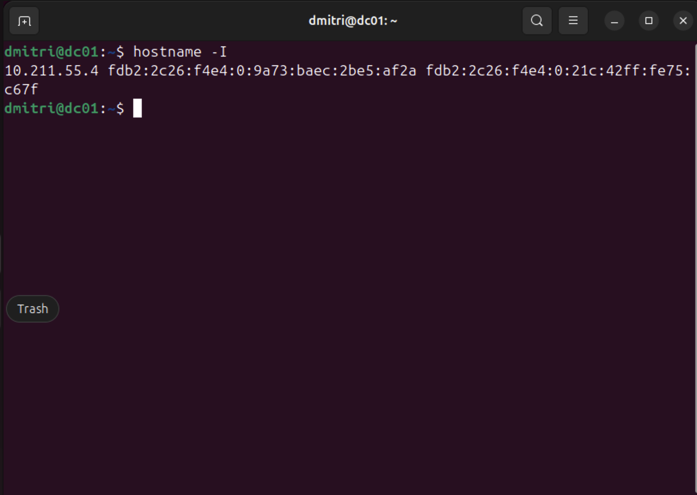
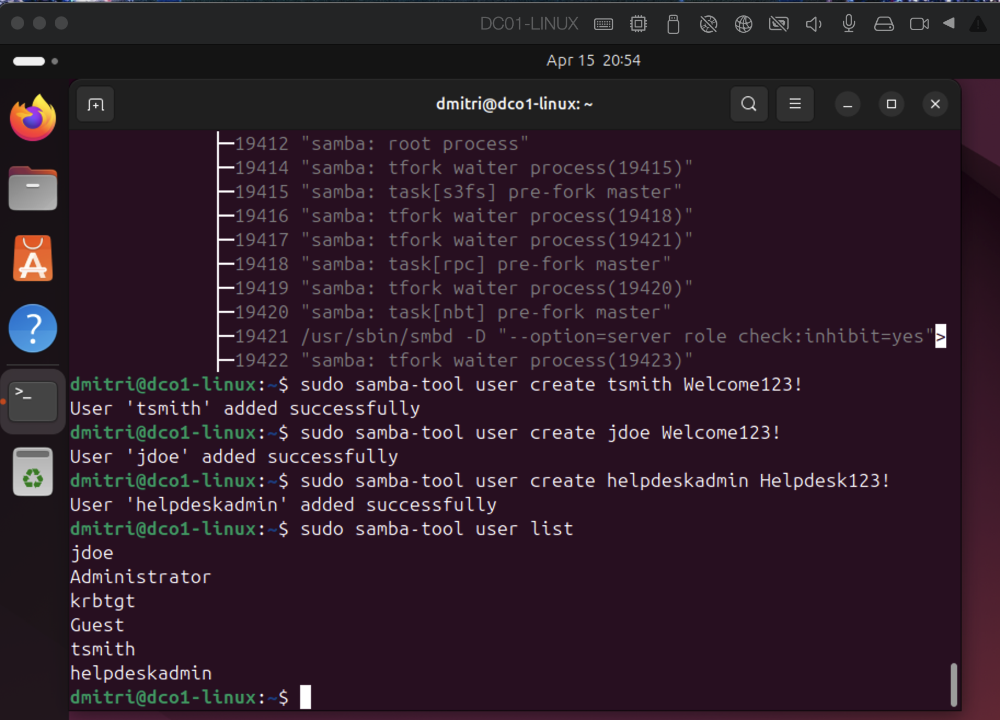
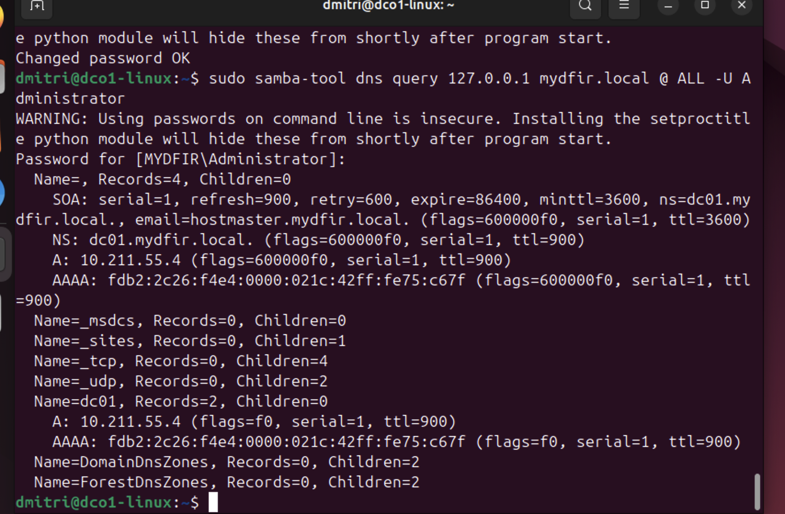
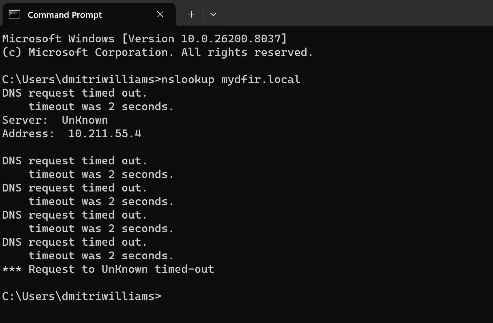
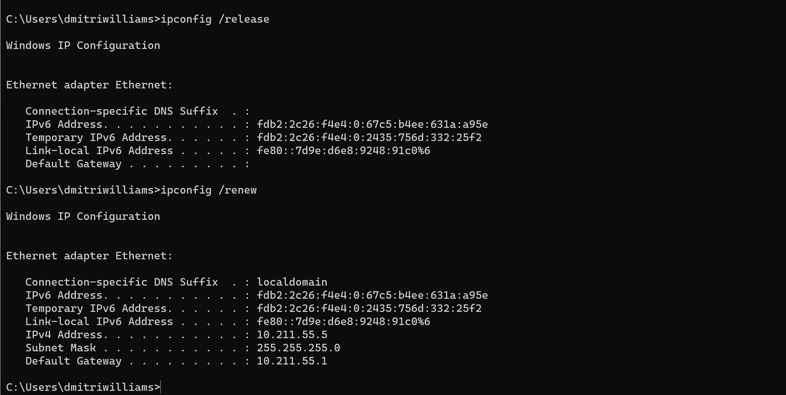
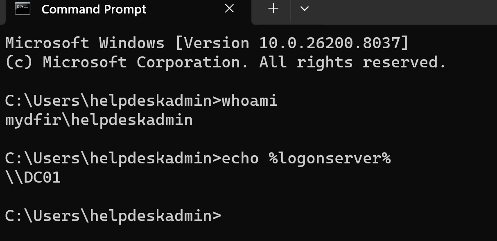

# Project 3 – Linux Active Directory Domain Lab (Samba + Windows 11)


---

## Overview

This project builds a fully functional **Active Directory domain lab** using Ubuntu Server as a Samba AD Domain Controller and a Windows 11 client joined to the domain. It demonstrates real-world enterprise identity infrastructure including domain provisioning, DNS configuration, Kerberos authentication, user lifecycle management, and Windows endpoint integration — all documented with architecture diagrams and validation evidence.

---

## Environment

| Tool | Purpose |
|------|---------|
| Ubuntu Server 24.04 | Samba Active Directory Domain Controller |
| Samba AD DC | Domain controller, DNS, Kerberos, LDAP services |
| Windows 11 | Domain-joined workstation / client endpoint |
| Parallels Desktop | Virtual network hosting both VMs |
| DNS / Kerberos | Authentication and name resolution services |
| SMB / LDAP | Domain communication protocols |
| Linux CLI / PowerShell | Administration and validation |
| GitHub | Documentation and version control |

---

## Lab Architecture

| Component | Value |
|-----------|-------|
| Domain | `mydfir.local` |
| Domain Controller | `dc01.mydfir.local` |
| DC IP Address | `10.211.55.4` |
| Windows Client IP | `10.211.55.5` |
| Test User | `helpdeskadmin` |
| Network | Parallels shared virtual network |


*Lab architecture showing Ubuntu DC, Windows 11 client, virtual switch, and cloud connectivity*

---

## Key Tasks Performed

### 🟢 Domain Controller Setup — Ubuntu Server + Samba

**Actions Taken:**
1. Installed Ubuntu Server 24.04 on Parallels VM
2. Installed and configured Samba as an Active Directory Domain Controller
3. Provisioned domain: `mydfir.local`
4. Configured internal DNS and Kerberos services
5. Verified Samba AD daemon active and ready to serve connections

**Principle Applied:** Enterprise-grade domain controller deployment using open-source Samba — identical protocol stack to Windows Server AD (LDAP, Kerberos, SMB, DNS).


*samba-ad-dc.service confirmed active (running) — status: "ready to serve connections"*

---

### 🔵 DC IP Validation — Linux

**Actions Taken:**
1. Ran `hostname -I` on the Ubuntu DC to confirm IP assignment
2. Verified DC IP: `10.211.55.4` — matching DNS and architecture config


*hostname -I confirming DC IP address at 10.211.55.4 on the Ubuntu server*

---

### 🟡 User Provisioning — samba-tool

**Actions Taken:**
1. Created domain users using `samba-tool user create`:
   - `tsmith` — User 'tsmith' added successfully
   - `jdoe` — User 'jdoe' added successfully
   - `helpdeskadmin` — User 'helpdeskadmin' added successfully
2. Ran `samba-tool user list` to confirm all users present in directory
3. Verified domain accounts: jdoe, Administrator, krbtgt, Guest, tsmith, helpdeskadmin


*samba-tool user create and user list — all domain users provisioned and confirmed*

---

### 🔴 DNS Configuration & Validation

**Actions Taken:**
1. Configured Windows 11 DNS to point to Samba DC (`10.211.55.4`)
2. Ran `samba-tool dns query 127.0.0.1 mydfir.local @ ALL` to validate DNS zone records
3. Confirmed SOA, NS, A, and AAAA records for `mydfir.local` and `dc01`
4. Verified DC A record resolving to `10.211.55.4`


*samba-tool dns query confirming SOA, NS, A, and AAAA records for the mydfir.local zone*

---

## Troubleshooting Scenarios

### DNS Timeout — Before Fix

Windows client ran `nslookup mydfir.local` and received repeated DNS request timeouts. Server was shown as Unknown despite DNS being pointed to `10.211.55.4`. Root cause: Samba DNS was not listening on the correct external interface.


*nslookup mydfir.local timing out — DNS not resolving from Windows client before interface fix*

### Windows DHCP Renew — Networking Fix

After resolving the Parallels shared network issue, `ipconfig /release` and `ipconfig /renew` were run on Windows 11 to force the client back onto the correct subnet. IPv4 address confirmed as `10.211.55.5` with gateway `10.211.55.1`.


*ipconfig /release and /renew confirming Windows client IP 10.211.55.5 on correct subnet*

| Issue | Root Cause | Resolution |
|-------|-----------|------------|
| DNS timeout between Windows and DC | Incorrect DNS interface binding | Rebound Samba DNS to correct interface |
| Broken VM shared networking | Parallels network misconfiguration | Restarted Parallels shared network |
| NetworkManager restart causing IP loss | DHCP conflict on Ubuntu | Locked static IP, disabled NetworkManager conflict |
| Windows domain join trust failures | DC DNS not resolving from client | Forced Windows DNS to point to `10.211.55.4` |
| Domain controller DNS not listening externally | Samba binding to loopback only | Corrected interfaces parameter in `smb.conf` |

---

## ✅ Validation Evidence

Domain authentication was confirmed after the Windows 11 client successfully joined `mydfir.local` and logged in as `helpdeskadmin`.

```cmd
whoami
mydfir\helpdeskadmin

echo %logonserver%
\\DC01
```


*whoami returning mydfir\helpdeskadmin and %logonserver% returning \\DC01 — full domain authentication confirmed*

---

## Screenshot Naming Reference

| File Name | Description |
|-----------|-------------|
| `lab-architecture-diagram.png` | Network architecture — DC, Windows client, virtual switch, cloud |
| `01-samba-ad-service-running.png` | Samba AD daemon active and running on Ubuntu DC |
| `linux-dc-ip-validation.png` | hostname -I confirming DC IP 10.211.55.4 |
| `02-samba-users-list.png` | samba-tool user create and user list — all domain users provisioned |
| `samba-dns-zone-validation.png` | samba-tool dns query confirming SOA, NS, A, AAAA records |
| `dns-timeout-troubleshooting-before-fix.png` | nslookup timing out before DNS interface fix |
| `windows-dhcp-renew-success.png` | ipconfig /release + /renew confirming Windows client IP |
| `helpdeskadmin-domain-login-validation.png` | whoami and %logonserver% confirming domain authentication |

---

## Skills Demonstrated

| Skill | How It Was Applied |
|-------|--------------------|
| Active Directory Administration | Provisioned and managed a full AD domain using Samba on Linux |
| Identity & Access Management | Created and validated domain users with role-appropriate access |
| DNS Troubleshooting | Resolved DNS binding, timeout, and name resolution failures across VMs |
| Windows Domain Join | Joined Windows 11 endpoint to Linux-hosted AD domain |
| Linux Systems Administration | Configured Ubuntu Server, Samba, and network interfaces via CLI |
| Kerberos Authentication | Validated Kerberos ticket issuance and domain authentication flow |
| Enterprise Network Troubleshooting | Diagnosed and resolved VM networking, IP, and subnet conflicts |
| User Lifecycle Management | Provisioned test users and validated domain authentication end-to-end |

---

## Lessons Learned

**DNS is the foundation of Active Directory.** Every domain join failure, authentication error, and name resolution issue in this lab traced back to DNS. Before troubleshooting anything else, validate that the client can resolve the DC by name — not just ping it by IP. `nslookup dc01.mydfir.local` became the first diagnostic step for every issue.

**Linux can run enterprise-grade AD infrastructure.** Samba implements the full Active Directory protocol stack — LDAP, Kerberos, SMB, DNS — compatible with Windows endpoints. Building this on Ubuntu rather than Windows Server removes the licensing dependency and proves the identity engineering skills transfer across platforms.

**Troubleshooting is part of the lab.** The domain join didn't work on the first attempt. NetworkManager caused IP conflicts. The DC was binding DNS to the wrong interface. Each failure was an opportunity to diagnose a real production-class problem. In an enterprise environment, these are the exact issues L1 and L2 support engineers escalate to IAM and infrastructure teams.

---

## Repository Structure

```text
Project-7-Linux-AD-Domain-Lab/
├── Project Screenshots/
│   ├── lab-architecture-diagram.png
│   ├── 01-samba-ad-service-running.png
│   ├── linux-dc-ip-validation.png
│   ├── 02-samba-users-list.png
│   ├── samba-dns-zone-validation.png
│   ├── dns-timeout-troubleshooting-before-fix.png
│   ├── windows-dhcp-renew-success.png
│   └── helpdeskadmin-domain-login-validation.png
├── documentation/
│   ├── architecture-overview.md
│   └── troubleshooting-notes.md
├── configs/
│   └── dns-settings.txt
└── README.md
```

---

## References

- [Samba AD DC Documentation](https://wiki.samba.org/index.php/Setting_up_Samba_as_an_Active_Directory_Domain_Controller)
- [Microsoft Active Directory Overview](https://learn.microsoft.com/en-us/windows-server/identity/ad-ds/get-started/virtual-dc/active-directory-domain-services-overview)
- [Kerberos Authentication Overview](https://learn.microsoft.com/en-us/windows-server/security/kerberos/kerberos-authentication-overview)
- [NIST SP 800-63 Digital Identity Guidelines](https://pages.nist.gov/800-63-3/)
